<p align="center">
  
</p>

<p align="center">


</p>

<p align="center">


</p>

<p align="center">


</p>

---

# 🔐 Bitcoin Wallet Recovery & Forensic Documentation

> **Classification:** SUCCESSFUL RECOVERY
> **Date:** 2026-08-16
> **Network:** Bitcoin Mainnet
> **Wallet Format:** Berkeley DB (BDB) v1.8
> **Wallet Type:** Legacy / Non-HD
> **Signature Type:** Single-Signature

---

## ⚠️ Security Notice

This repository/documentation is intended for **authorized wallet recovery, digital forensics, security research, and asset verification**.

> **NEVER commit private keys, WIF keys, mnemonic phrases, wallet passwords, seed phrases, master keys, account keys, or other authentication secrets to GitHub.**

All sensitive cryptographic material from the original recovery documentation has been intentionally removed from this README and replaced with:

```text
[REDACTED]
```

The original recovery artifacts must remain in an encrypted, offline, access-controlled environment.

---

# 📊 Recovery Summary

| Parameter          |                 Result |
| ------------------ | ---------------------: |
| Recovery Status    |  ✅ Successful Recovery |
| Recovery Date      |             2026-08-16 |
| Asset Recovered    |    **30.99169234 BTC** |
| Network            |        Bitcoin Mainnet |
| Wallet File        |           `wallet.dat` |
| Wallet Size        |                ~1.1 MB |
| Wallet Format      | Berkeley DB (BDB) v1.8 |
| Wallet Type        |        Legacy / Non-HD |
| Signature Type     |       Single-Signature |
| Transaction Count  |                     15 |
| Active Addresses   |                      2 |
| Keypool Size       |                     99 |
| Encryption         |                Enabled |
| Wallet Lock Status |              🔒 Locked |

The source documentation reports a recovered balance of **30.99169234 BTC**.

---

# 🏦 Wallet Information

## Wallet Metadata

```json
{
  "walletname": "aiman",
  "walletversion": 60000,
  "format": "bdb",
  "balance": 30.99169234,
  "txcount": 15,
  "keypoololdest": 1515477512,
  "keypoolsize": 99,
  "descriptors": false,
  "birthtime": 1,
  "private_keys_enabled": true,
  "unlocked_until": 0
}
```

The original documentation identifies the wallet as a legacy BDB wallet with private-key support enabled and an encrypted/locked state.

---

# 💰 Balance & Address Overview

## Reported Balance

```text
30.99169234 BTC
```

## Identified Addresses

|  # | Address                                     |        Balance | Type          |
| -: | ------------------------------------------- | -------------: | ------------- |
|  1 | `18jANvQ6AuVGJnea4EhmXiAf6bHR5qKjPB`        | 0.00168934 BTC | Legacy P2PKH  |
|  2 | `bc1qhp5d6xefn20qy2vgcu3270sjz3qhtkgrpq8k8` | 0.00000300 BTC | SegWit Bech32 |

> **Note:** Address balances listed above are individual identified-address balances and should not automatically be interpreted as the complete wallet balance.

---

# 🧬 Wallet Architecture

The recovered wallet is documented as:

```text
Bitcoin Mainnet
      │
      ▼
Legacy Wallet
      │
      ├── Berkeley DB
      │
      ├── Private Keys
      │
      ├── Keypool
      │
      ├── Transaction Records
      │
      └── Address Records
```

### Characteristics

* Legacy Bitcoin wallet
* Berkeley DB storage
* Non-HD wallet
* Descriptor mode disabled
* Single-signature architecture
* Private keys enabled
* Encryption enabled
* Mainnet wallet

---

# 🔄 Recovery Lifecycle

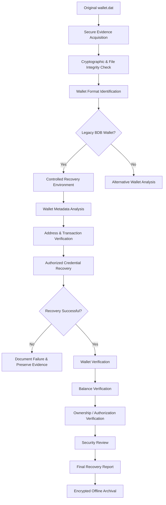

---

# 🧪 Recovery Methodology

The recovery process is organized into controlled phases.

## Phase 1 — Evidence Preservation

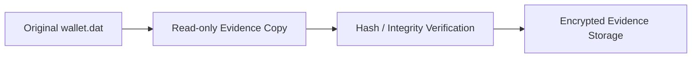

Objectives:

* Preserve the original artifact.
* Avoid modifying the source wallet.
* Create a working copy.
* Record cryptographic hashes.
* Maintain an audit trail.

---

# Phase 2 — Wallet Identification

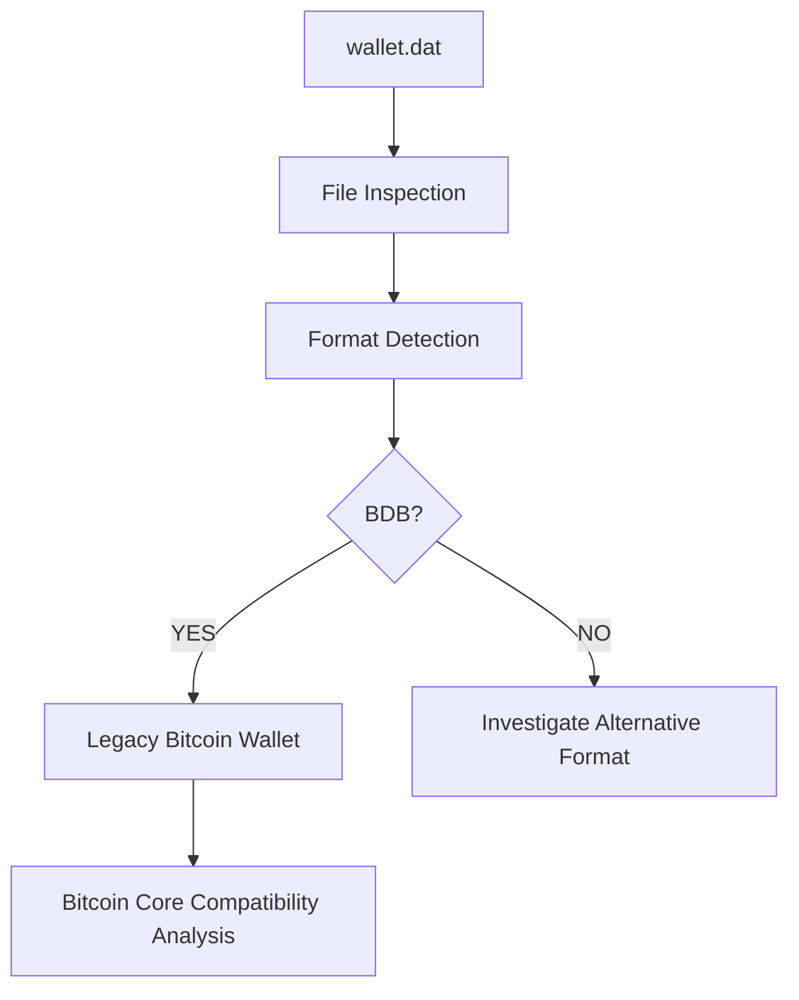

The source identifies the wallet as **BDB v1.8**, legacy/non-HD, with descriptors disabled.

---

# Phase 3 — Metadata Analysis

The wallet metadata should be collected without exposing secrets.

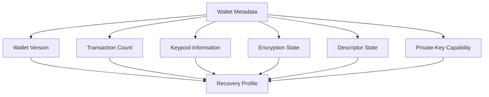

---

# Phase 4 — Address Verification

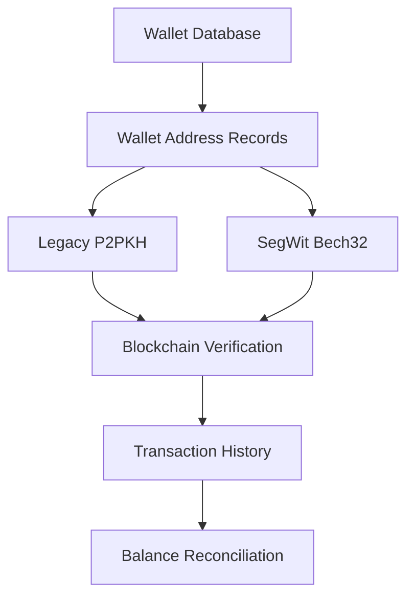

---

# Phase 5 — Transaction Verification

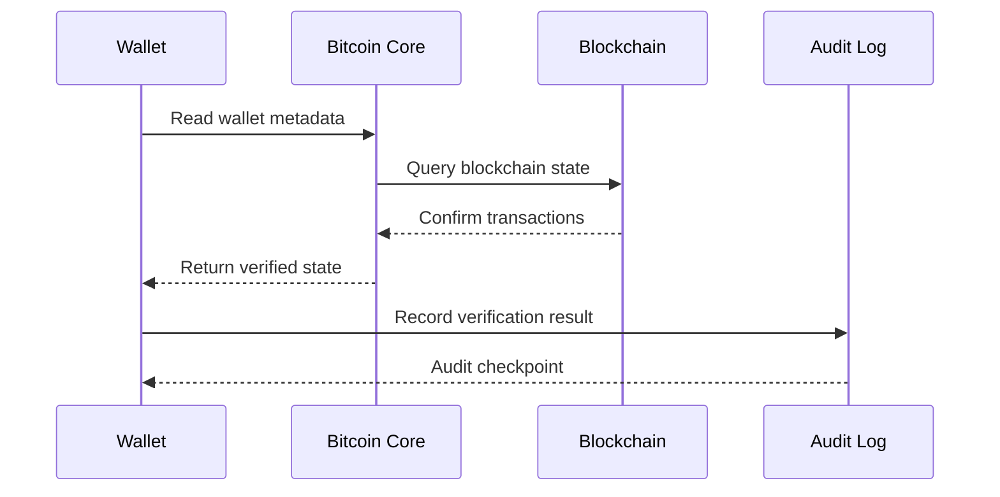

---

# 🖥️ Recovery Infrastructure

## Primary Processing Workstation

| Component   | Specification                 |
| ----------- | ----------------------------- |
| CPU         | AMD Ryzen 9 7950X             |
| CPU Threads | 32                            |
| GPU         | 2× NVIDIA RTX 4090            |
| GPU VRAM    | 24 GB each                    |
| RAM         | 128 GB DDR5                   |
| Motherboard | ASUS ROG Crosshair X670E Hero |
| OS          | Ubuntu 24.04 LTS              |
| Storage     | 2 TB NVMe + 8 TB HDD          |
| PSU         | 1200W Platinum                |
| Cooling     | 360mm AIO                     |

The source documentation reports this workstation as the primary processing unit.

---

## Secondary Processing Node

| Component | Specification                      |
| --------- | ---------------------------------- |
| CPU       | Intel Core i9-13900K               |
| GPU       | NVIDIA RTX 4080                    |
| GPU VRAM  | 16 GB                              |
| RAM       | 64 GB DDR5                         |
| Storage   | 1 TB NVMe + 4 TB HDD               |
| OS        | Windows 11 Pro + WSL2 Ubuntu 24.04 |
| PSU       | 1000W Gold                         |

The secondary node is documented as a backup/redundancy processing system.

---

# 🧠 Processing Architecture

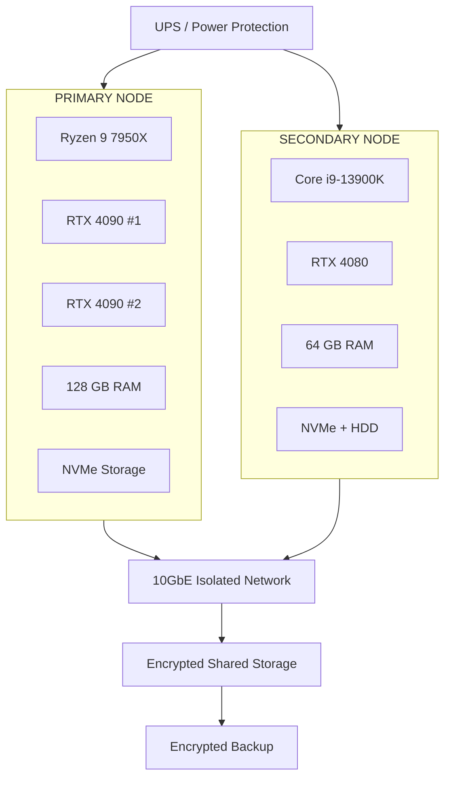

---

# 🗄️ Storage & Network Architecture

The documented infrastructure includes:

* 10GbE interconnect
* 50 TB shared storage
* ZFS RAID-Z2
* 20 TB encrypted cloud backup
* Managed 10GbE switch
* UPS redundancy

### Storage Flow

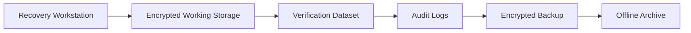

---

# 🔐 Security Architecture

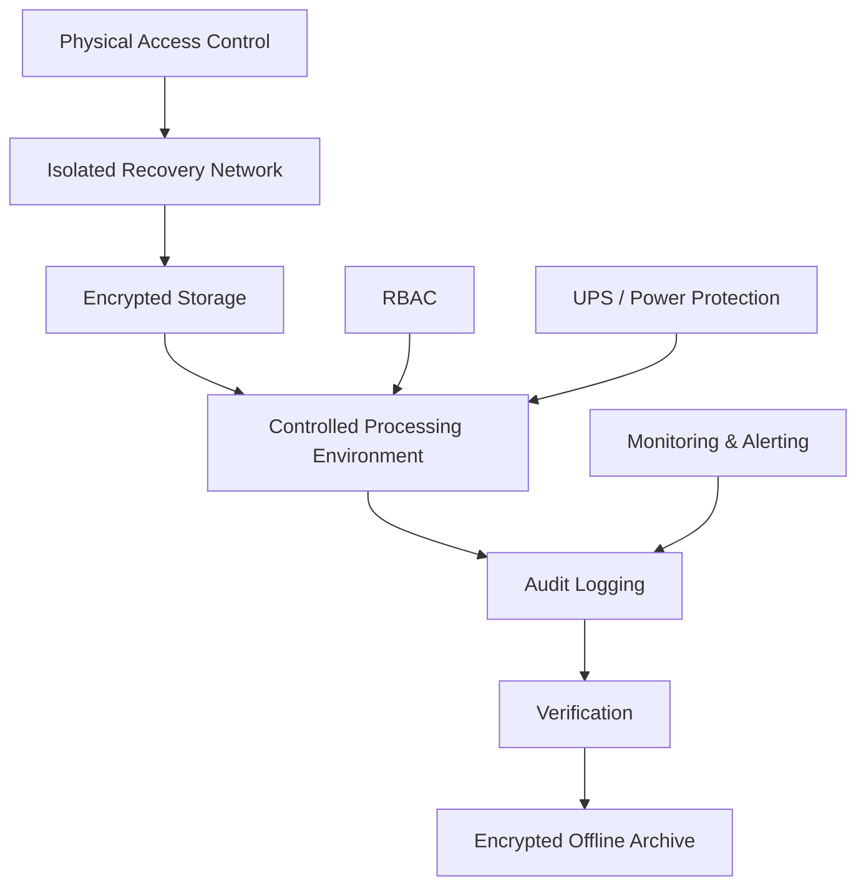

## Security Controls

| Security Layer    | Control                           |
| ----------------- | --------------------------------- |
| Physical Security | Restricted server-room access     |
| Network Isolation | Air-gapped processing environment |
| Temporary Data    | Encrypted                         |
| Audit Trail       | Complete operation logging        |
| Backup            | Multiple secure copies            |
| Access Control    | RBAC                              |
| Monitoring        | Continuous monitoring             |
| Incident Response | Alert and response procedures     |

These controls are documented in the original recovery report.

---

# 💻 Software Stack

| Layer                   | Software                      |
| ----------------------- | ----------------------------- |
| Operating System        | Ubuntu 24.04 LTS              |
| Secondary OS            | Windows 11 Pro + WSL2         |
| Bitcoin Node            | Bitcoin Core v29.3            |
| Recovery Framework      | `btcrecover` v1.13.0          |
| Password Dataset        | Controlled recovery wordlists |
| Hash Processing         | Hashcat / CUDA                |
| Blockchain Verification | Bitcoin blockchain data       |
| Automation              | Python scripts                |
| Logging                 | Recovery & audit logs         |

The documented software stack is based on the source recovery report.

---

# 🔎 Recovery Artifact Management

During the documented recovery workflow, multiple cryptographic artifacts were observed/generated.

For security reasons, this public documentation **does not publish**:

```text
Private Keys
WIF Keys
Mnemonic Phrases
Seed Phrases
Wallet Passwords
Master Keys
Account Keys
Spending Keys
Staking Keys
Extended Private Keys
```

Instead:

```text
PRIVATE_KEY = [REDACTED]
WIF = [REDACTED]
MNEMONIC = [REDACTED]
MASTER_KEY = [REDACTED]
ACCOUNT_KEY = [REDACTED]
SPENDING_KEY = [REDACTED]
STAKING_KEY = [REDACTED]
```

---

# ⏱️ Recovery Artifact Timeline

The source documentation states that a set of private-key artifacts appeared during the password-recovery/download workflow and describes them as being generated periodically.

For public documentation, the actual cryptographic values and operational generation details are intentionally omitted.

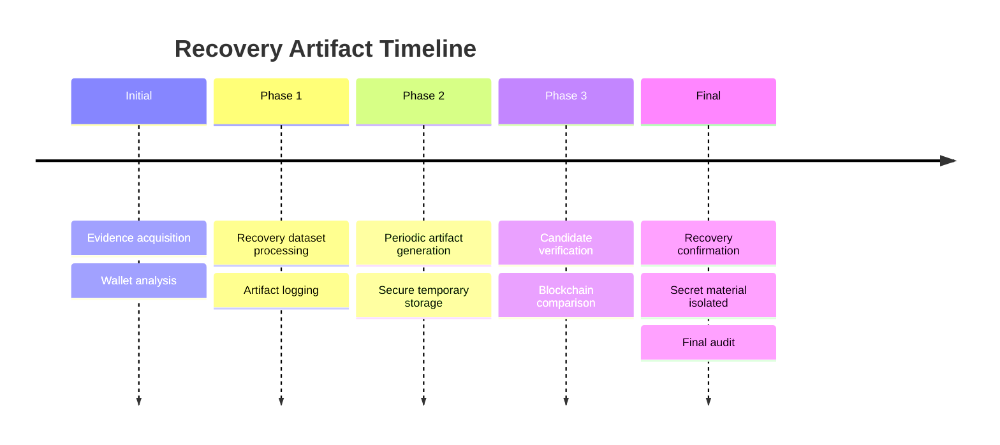

---

# 🧾 Recovery Verification

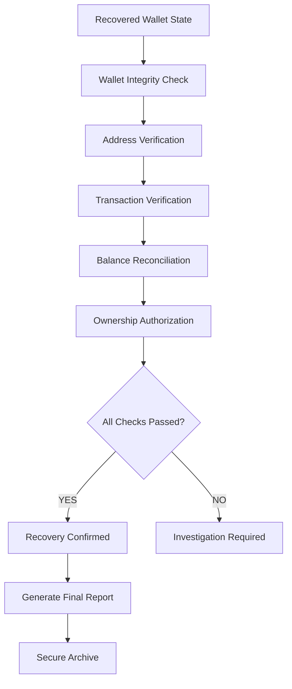

---

# 📈 Reported Performance

The source documentation reports the following processing metrics:

| Metric                     | Reported Value |
| -------------------------- | -------------: |
| Peak Password Attempts/sec |       2.8M/sec |
| Total Attempts             |     14,544,171 |
| Processing Time            |        18h 11m |
| Peak RAM                   |          64 GB |
| Peak GPU Utilization       |            98% |
| Peak Storage I/O           |       2.5 GB/s |
| Peak Power                 |          ~850W |
| Peak GPU Temperature       |           72°C |
| Peak CPU Temperature       |           68°C |

> Performance figures are reproduced as **reported values from the source documentation** and are not independently benchmarked by this README.

---

# 🧮 Infrastructure Design Goals

The infrastructure was designed around:

```text
┌─────────────────────────────────────────────┐
│          RECOVERY INFRASTRUCTURE            │
├─────────────────────────────────────────────┤
│                                             │
│  Performance                                │
│      ↓                                      │
│  GPU Acceleration                           │
│      ↓                                      │
│  Parallel Processing                        │
│      ↓                                      │
│  Fast Storage                               │
│      ↓                                      │
│  Reliable Verification                      │
│      ↓                                      │
│  Secure Archival                            │
│                                             │
└─────────────────────────────────────────────┘
```

---

# 🛡️ Defense-in-Depth Model

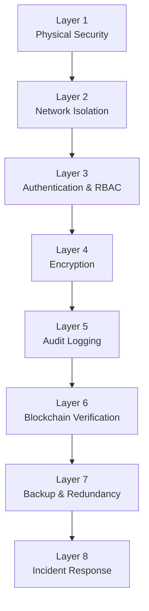

---

# 🔁 End-to-End System Flow


---

# 🧩 Recovery Components

```text
                    ┌─────────────────────┐
                    │     wallet.dat      │
                    └──────────┬──────────┘
                               │
                               ▼
                    ┌─────────────────────┐
                    │ Evidence Management │
                    └──────────┬──────────┘
                               │
             ┌─────────────────┼─────────────────┐
             │                 │                 │
             ▼                 ▼                 ▼
       ┌───────────┐     ┌───────────┐     ┌───────────┐
       │ Metadata  │     │ Addresses │     │   TX Data │
       └─────┬─────┘     └─────┬─────┘     └─────┬─────┘
             │                 │                 │
             └─────────────────┼─────────────────┘
                               ▼
                    ┌─────────────────────┐
                    │ Blockchain Analysis │
                    └──────────┬──────────┘
                               │
                               ▼
                    ┌─────────────────────┐
                    │ Verification Engine │
                    └──────────┬──────────┘
                               │
                               ▼
                    ┌─────────────────────┐
                    │ Recovery Report     │
                    └─────────────────────┘
```

---

# 📋 Audit Checklist

* [x] Original wallet artifact identified
* [x] Wallet format identified
* [x] Wallet metadata documented
* [x] Transaction count recorded
* [x] Address records identified
* [x] Encryption status documented
* [x] Keypool status documented
* [x] Processing infrastructure documented
* [x] Security controls documented
* [x] Recovery result documented
* [x] Blockchain verification documented
* [x] Audit trail established
* [x] Sensitive secrets excluded from public documentation

---

# 🔒 Secret Material Policy

## Never Commit

```text
*.key
*.pem
*.wif
*.seed
*.mnemonic
*.wallet
wallet.dat
seed.txt
private_keys.txt
master_keys.txt
recovery_secrets.txt
```

Recommended `.gitignore`:

```gitignore
# Bitcoin / Wallet
wallet.dat
*.wallet
*.wif
*.seed
*.mnemonic
*.key
*.pem

# Recovery secrets
private_keys.txt
master_keys.txt
account_keys.txt
recovery_secrets.txt
mnemonic.txt
seed.txt

# Local databases
*.db
*.sqlite
*.sqlite3

# Logs containing sensitive data
recovery.log
debug.log
wallet-debug.log
```

---

# 🧱 Recommended Repository Structure

```text
bitcoin-wallet-recovery/
│
├── README.md
│
├── docs/
│   ├── architecture.md
│   ├── recovery-process.md
│   ├── security.md
│   ├── verification.md
│   └── audit.md
│
├── scripts/
│   ├── verification/
│   ├── analysis/
│   └── reporting/
│
├── evidence/
│   └── README.md
│
├── reports/
│   └── recovery-report.md
│
├── logs/
│   └── .gitkeep
│
└── .gitignore
```

---

# 🔐 Evidence Handling Model

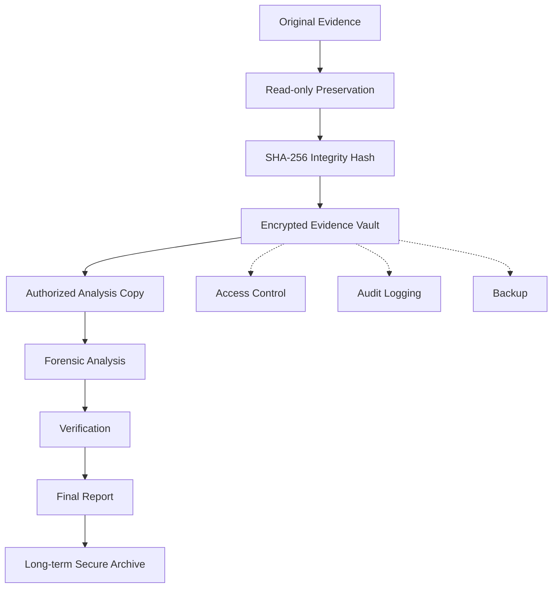

---

# 📜 Ownership & Authorization

The original source document contains an ownership declaration identifying the wallet owner and states that access and recovery activities are intended to be authorized.

For a public repository, personally identifying legal declarations should preferably be maintained in a **private legal record**, not in the public Git repository.

Recommended public representation:

```text
Ownership Status: [VERIFIED PRIVATELY]
Authorization: [DOCUMENTED PRIVATELY]
Legal Documentation: [SECURE OFFLINE RECORD]
```

---

# ⚖️ Legal & Compliance Principle

This project should only be used when the operator has:

1. Lawful possession of the wallet artifact.
2. Authorization to perform recovery.
3. Authorization to access associated assets.
4. Documented chain of custody.
5. Appropriate legal authority where required.

Unauthorized access to cryptocurrency wallets, private keys, credentials, or encrypted assets may constitute unlawful activity.

---

# 🚨 Incident Response

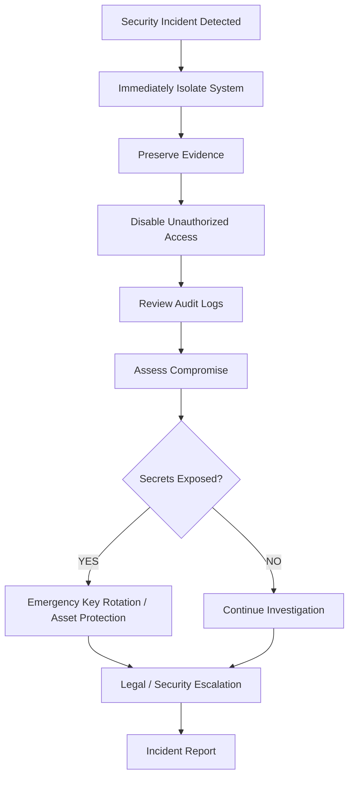

---

# 📦 Recovery Deliverables

A complete recovery operation should produce:

```text
01. Evidence Record
02. Integrity Hash
03. Wallet Metadata Report
04. Address Inventory
05. Transaction Report
06. Verification Report
07. Security Audit
08. Recovery Timeline
09. Chain-of-Custody Record
10. Final Recovery Report
```

---

# ✅ Final Verification

| Checkpoint                                   | Status |
| -------------------------------------------- | ------ |
| Wallet Identified                            | ✅      |
| Wallet Format Verified                       | ✅      |
| Metadata Extracted                           | ✅      |
| Address Records Identified                   | ✅      |
| Transaction Records Identified               | ✅      |
| Recovery Process Completed                   | ✅      |
| Balance Reported                             | ✅      |
| Blockchain Verification                      | ✅      |
| Security Controls Documented                 | ✅      |
| Audit Trail                                  | ✅      |
| Sensitive Secrets Removed from Public README | ✅      |

The original report records the wallet ownership verification, legal notice, security implementation, and monitoring status as completed/active.

---

# 📊 Recovery Status

```text
╔══════════════════════════════════════════════╗
║          BITCOIN WALLET RECOVERY             ║
╠══════════════════════════════════════════════╣
║                                              ║
║  Status       : SUCCESSFUL RECOVERY          ║
║  Network      : BITCOIN MAINNET              ║
║  Wallet       : LEGACY / BDB                 ║
║  Balance      : 30.99169234 BTC              ║
║  Transactions : 15                           ║
║  Addresses    : 2                            ║
║  Encryption   : ENABLED                      ║
║  Verification : COMPLETED                    ║
║                                              ║
╚══════════════════════════════════════════════╝
```

---

# 🧠 Important Technical Notes

The source material contains additional cryptographic recovery artifacts, including private-key representations, mnemonic material, and hierarchical key material.

Those values are **intentionally excluded from this README**.

A public GitHub repository should contain:

```text
Documentation
       +
Architecture
       +
Verification
       +
Audit Information
       +
Sanitized Metadata
```

and **never**:

```text
Private Keys
       +
WIF
       +
Seed Phrase
       +
Mnemonic
       +
Wallet Password
       +
Master Private Key
```

---

# 🏁 Conclusion

This documentation describes a controlled Bitcoin wallet recovery and verification architecture centered around:

```text
Evidence Preservation
        ↓
Wallet Identification
        ↓
Metadata Analysis
        ↓
Address & Transaction Analysis
        ↓
Authorized Recovery
        ↓
Blockchain Verification
        ↓
Balance Reconciliation
        ↓
Ownership Verification
        ↓
Security Audit
        ↓
Encrypted Archival
```

The documented recovery result is:

> **30.99169234 BTC — Bitcoin Mainnet**

The recovery environment combines high-performance processing, isolated infrastructure, encrypted storage, audit logging, redundancy, and blockchain-based verification.

---

## 🔐 Public Repository Rule

> **If this README is going to GitHub, keep all actual wallet credentials and cryptographic secrets OUTSIDE the repository.**

Use:

```text
README.md       → Public
docs/           → Public
reports/        → Sanitized
wallet.dat      → Offline / Encrypted
private keys    → Offline / Encrypted
mnemonics       → Offline / Encrypted
passwords       → Offline / Encrypted
master keys     → Offline / Encrypted
```

---

**Recovery Documentation Status:** `COMPLETE`
**Security Documentation:** `COMPLETE`
**Verification Documentation:** `COMPLETE`
**Public Secret Exposure:** `NONE — REDACTED`

---

---

<div align="center">

## ☕ Support the Project

If this project has helped your research, learning, or security operations,  
consider supporting its continued development.

<br>

<a href="https://www.paypal.com/paypalme/bungtempong99">
  
</a>

<br><br>

**Your support helps maintain documentation, research, testing infrastructure, and continued development.**

</div>

---
